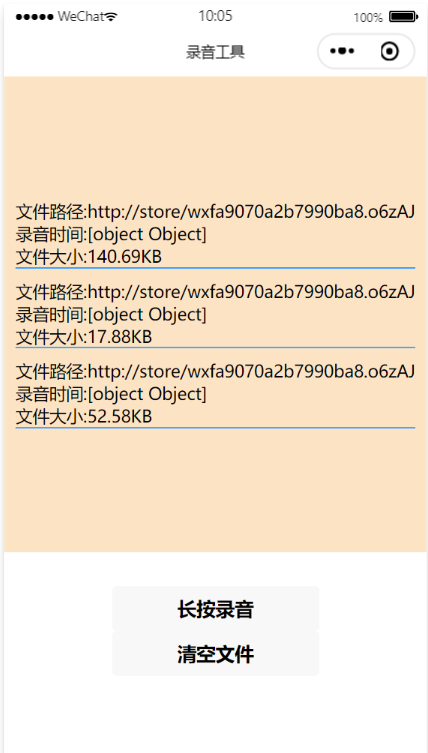
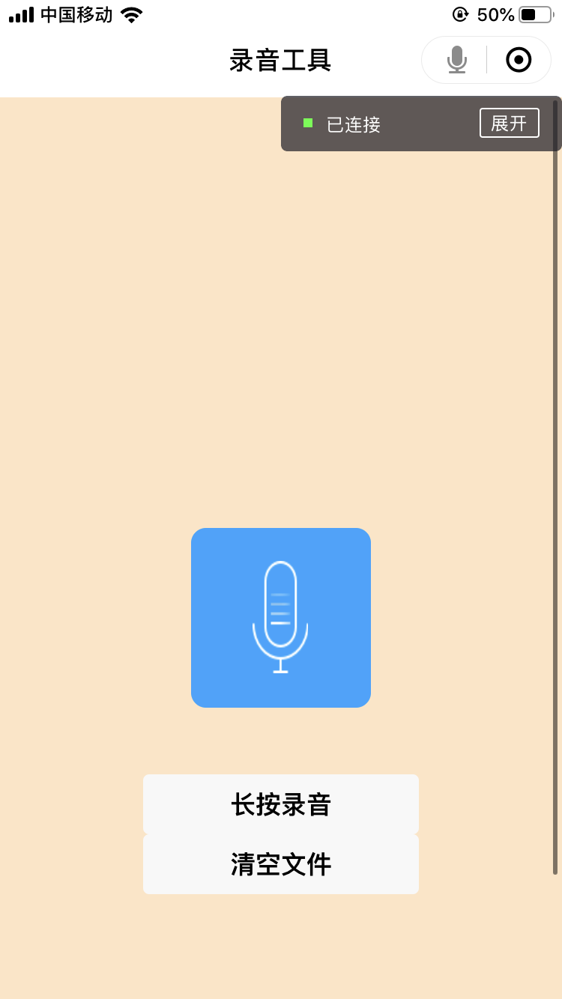

<h1>作业介绍</h1> 

<strong>项目名称：</strong>录音小工具

<strong>主要功能：</strong> 长按按钮开始录音、录音结束后显示录音文件、点击录音文件开始播放录音、清空所有录音文件

<strong>涉及知识点：</strong>通过wx:if控制组件显示、自定义组件点击事件、<strong>小程序API（录音类：wx.startRecord, wx.stopRecord,wx.playVoice, 文件管理类：wx.saveFile, wx.getSvaedFileList, wx.removeSavedFile）</strong>、麦克风帧动画（setInterval)

<strong>文件构成：</strong>
该作业包含三个文件夹和七个文件。结构如下：
 
<table>
<thead>
<tr>
<th>文件名</th>
<th>说明</th>
</tr>
</thead>
<tbody>
<tr>
<td>images</td>
<td>images文件夹用于储存麦克风帧动画图片</td>
</tr>
<tr>
<td>pages</td>
<td>pages文件夹用于储存主要功能页面（index页面）的配置文件（包含.wxml、.wxss、.json及.js文件）</td>
</tr>
<tr>
<td>utils</td>
<td>用于储存util.js文件</td>
</tr>
<tr>
<td>app.js、app.json、app.wxss</td>
<td>用于储存小程序的全局变量</td>
</tr>
<tr>
<td>Preview01.PNG、Preview02.png</td>
<td>小程序录音页面和录音文件页面预览图</td>
</tr>
</tbody>
</table>

<strong>小程序效果预览图：</strong>

录音文件页面

</img> 

录音页面

</img> 