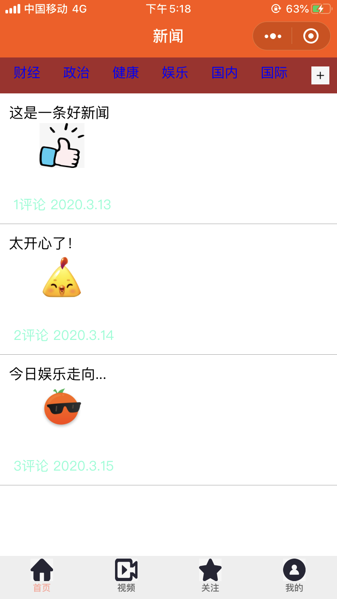

<h1>作业介绍</h1><br>
<p><strong>项目名称：</strong>仿新闻小程序</p>
<p><strong>主要功能：</strong>实现课件中的仿新闻小程序代码，没有调用API，数据均为编造的本地数据，通过函数进行了调用</p>

<p><strong>涉及知识点：</strong>Loading设置、wxml标签、wxss设置（新掌握display设置，boxing设置和标签位置设置）、周期函数使用，自定义函数调用，本地数据绑定、animation动画设置</p>
<p><strong>文件构成：</strong>
该作业包含两个文件夹和六个文件。结构如下：</p><br>
<table>
<thead>
<tr>
<th>文件名</th>
<th>说明</th>
</tr>
</thead>
<tbody>
<tr>
<td>imges文件夹</td>
<td>用于储存该小程序中需要用到的所有图片</td>
</tr>
<tr>
<td>pages</td>
<td>分为四个tabBar页面（attention关注页面、homePage新闻主页面、userCenter用户页面、video视频页面）</td>
</tr>
<tr>
<td>pages/homePage/homePage.wxml</td>
<td>设置主页布局（参考课件中代码）</td>
</tr>
<tr>
<td>pages/homePage/homePage.wxss</td>
<td>主页样式设置（参考课件中代码）</td>
</tr>
<tr>
<td>pages/homePage/homePage.js</td>
<td>存储原始数据（如新闻列表、评论详情等）、设置周期函数（创建动画实例且进行设置）和自定义函数（typeClick, addMoreData及readList），通过函数操作本地数据（this.setData）</td>
</tr>
<tr>
<td>preview.png</td>
<td>小程序效果预览图（如下）</td>
</tr>
</tbody>
</table>

<p><strong>小程序效果预览图：</strong></p>

</img>

<p><strong>函数中进行本地数据操作：</strong></p>

```
//onLoad周期函数中会调用readList()函数
readList(){
    this.setData(
      {
        detaildata:[
          {
            title:"这是一条好新闻",
            comment_count:1,
            publish_time:"2020.3.13",
            has_image:true,
            image_list: [{ url: "../../imges/happy.jpg" }]
          },
          {
            title:"太开心了！",
            comment_count:2,
            publish_time: "2020.3.14",
            has_image: true,
            image_list: [{url:"../../imges/joy.jpg"}]
          },
          {
            title: "今日娱乐走向...",
            comment_count:3,
            publish_time: "2020.3.15",
            has_image: true,
            image_list: [{ url: "../../imges/fun.jpg" }]
          }
        ]
      }
    )
  }
```

