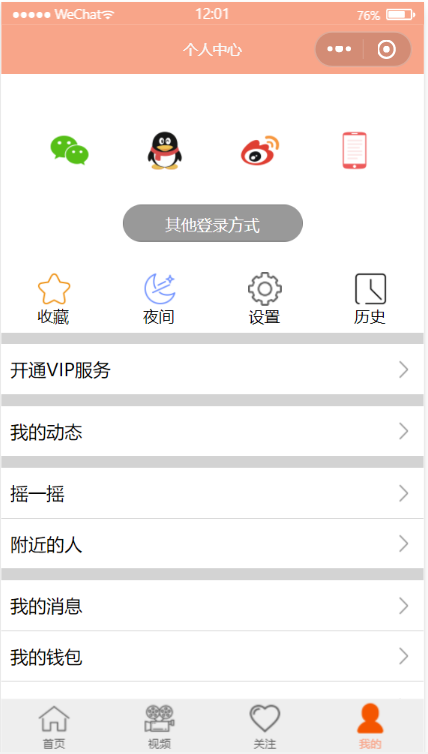

<h1>作业介绍</h1> 

<strong>项目名称：</strong>“仿新闻小程序”用户页面

<strong>主要功能：</strong> 用户通过微信登录、微信支付

<strong>涉及知识点：</strong>微信小程序登录并获取信息API（wx.login, wx.getSetting）、微信支付API（wx.requestPayment）、MD5加密编码（用于微信支付）

<strong>文件构成：</strong>
该作业包含三个文件夹和六个文件。结构如下：
 
<table>
<thead>
<tr>
<th>文件名</th>
<th>说明</th>
</tr>
</thead>
<tbody>
<tr>
<td>imges</td>
<td>imges文件夹用于储存小程序所需的icon图片</td>
</tr>
<tr>
<td>pages</td>
<td>（课件代码）pages文件夹用于储存页面的配置文件（包含.wxml、.wxss、.json及.js文件）和外部调用的MD5.js文件</td>
</tr>
<td>app.js、app.json、app.wxss</td>
<td>用于储存小程序的全局变量</td>
</tr>
<tr>
<td>Preview.PNG</td>
<td>小程序用户界面预览图</td>
</tr>
</tbody>
</table>

<strong>小程序效果预览图：</strong>

