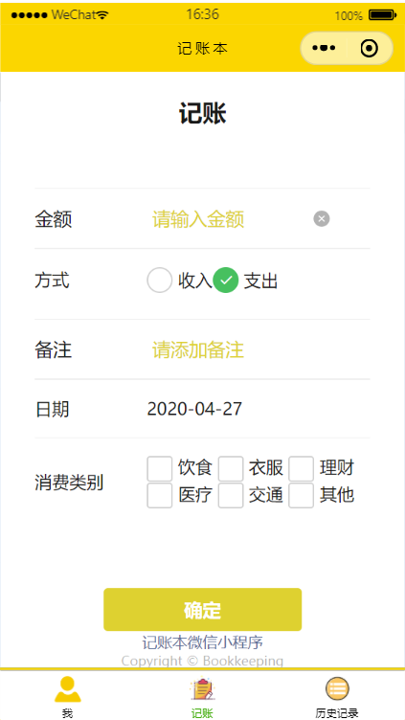
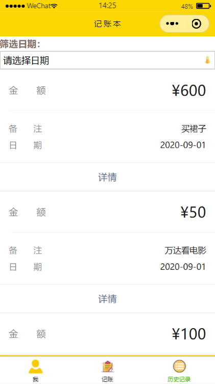
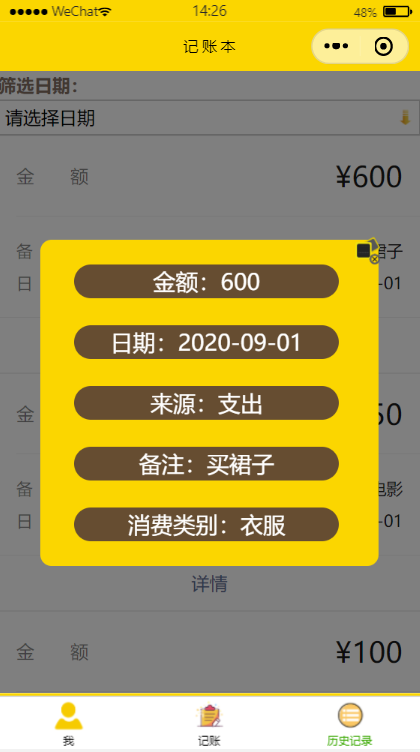
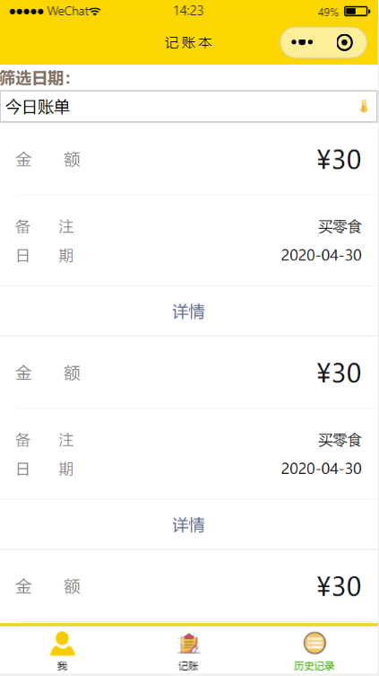

<h1>个人项目介绍</h1> 

<strong>项目名称：</strong>记账本

<strong>主要功能：</strong> 微信用户登录、表单记账、历史记账查看（概览与详情）、历史记账筛选（今日记账与本月记账）

<strong>涉及知识点：</strong>

  <strong> 前端：</strong>

- <strong>获取用户信息：</strong>app.globalData.userInfo；
- <strong>小程序自定义组件：</strong>components，应用于index.wxml自定义3D轮播图展示；
- <strong>tabBar与tabBar页面跳转</strong>（wx.switchTab），应用于“首页”点击头像开始记账；
- <strong>WeUI开发框架调用：</strong>“记账”页面（record.wxml）表单与页脚样式+“历史记录”页面（caculate.wxml）页面页眉及展现样式；
- <strong>小程序基本组件：</strong>时间选择器swiper、文本框、单选多选按钮、提交按钮等；
- <strong>小程序api：</strong>wx.showToast、网络请求wx.request（回调函数接收并处理后端返回数据）等；
- <strong>wx:if</strong>控制组件展示与隐藏（应用于“历史记录页面”详情页浮窗设计与自定义下拉菜单选择筛选条件） 与<strong>wx:for</strong>渲染列表；

<strong>后端（PHP+Linux云服务器+Mysql数据库）：</strong>

- 数据库设计；
- 接收前端表单参数并写入数据库；
- 数据库检索（全部检索和按条件检索）；

<strong>文件构成：</strong>
该作业包含五个文件夹和十二个文件。结构如下：
 
<table>
<thead>
<tr>
<th>文件（夹）名</th>
<th>说明</th>
</tr>
</thead>
<tbody>
<tr>
<td>PHP</td>
<td>用于储存小程序后端代码，其中keep.php处理表单数据，response.php检索数据库数据并向小程序返回数据，getdata.php返回当日记账数据，getmonth.php返回本月记账数据</td>
</tr>
<tr>
<td>components/customSwiper</td>
<td>用于储存自定义3D轮播图组件的配置文件（包含.wxml、.wxss、.json及.js文件）</td>
</tr>
<tr>
<td>images</td>
<td>用于储存小程序所需图片，为避免代码包过大无法进行真机调试，部分图片存至服务器</td>
</tr>
<tr>
<td>pages</td>
<td>用于储存小程序三个功能页面的配置文件（包含.wxml、.wxss、.json及.js文件），其中index页面为小程序“首页”，record页面为“记账”页面，calculate页面为“历史记录”页面</td>
</tr>
<tr>
<td>app.js、app.json、app.wxss</td>
<td>用于储存小程序的全局变量</td>
</tr>
<tr>
<td>weui.wxss</td>
<td>外部调用的WeUI样式文件</td>
</tr>
<tr>
<td>index.png</td>
<td>小程序“首页”预览图</td>
</tr>
<tr>
<td>record.png</td>
<td>小程序“记账”页面预览图</td>
</tr>
<tr>
<td>calculate.PNG</td>
<td>小程序“历史记录”页面预览图</td>
</tr>
<tr>
<td>detail.PNG</td>
<td>小程序“历史记录”页面点击“详情”按钮后展示的“账目详情”浮窗预览图</td>
</tr>
<tr>
<td>today.PNG</td>
<td>小程序“历史记录”页面点击“今日账单”后账目显示当日的账目，预览图</td>
</tr>
<tr>
<td>李响-201611680085.pptx</td>
<td>个人项目汇报ppt</td>
</tr>
</tbody>
</table>

<strong>过程中遇到的部分问题及解决方案：</strong>

1. 小程序代码包过大无法进行真机测试？
	将前端页面所需图片放入云端服务器中储存，图片scr属性直接访问服务器图片。
2. WeUI开发框架表单JavaScript无法引用？
	仅前端样式使用WeUI框架，根据自己的功能需求在页面js文件中重新写JavaScript。
3. 调用自定义组件后组件不显示？
	通过调试器查看页面每部分的数值，发现组件的宽为0。自定义组件wxss样式的长宽如果写为百分号的形式，调用组件时需要给组件定义具体的数值。

<strong>小程序效果预览图：</strong>

“首页”预览

</img> 

“记账”页面

</img> 

“历史记录”页面预览

</img> 

"详情浮窗"预览

</img> 

"今日账单"预览

</img> 
